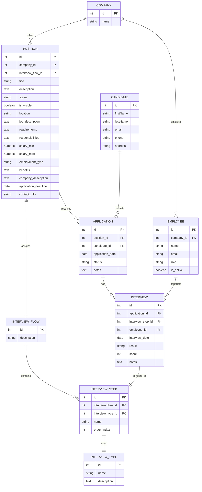

# Prompt para Cursor Agent – Migración de Base de Datos (gestión de talento)

## 🎯 Objetivo
Actualizar el esquema de la base de datos PostgreSQL de la aplicación de **gestión de talento** para incorporar las entidades definidas en el ERD proporcionado, aplicando **buenas prácticas de modelado (normalización, índices, claves externas, restricciones, tipos adecuados)** y generando la migración completa mediante **Prisma ORM**.

## 📦 Contexto
- Frontend: React + React‑Bootstrap  
- Backend: Node + Express en TypeScript (arquitectura por capas)  
- ORM: Prisma  
- DB: PostgreSQL (Docker Compose)  
- Tests: Jest  
- Herramienta de desarrollo: ts-node-dev  
- **No se debe modificar ningún archivo fuente salvo `schema.prisma`** (y sólo mediante copia en el nuevo directorio indicado).  

## 📁 Entregables obligatorios
Se creará un nuevo directorio raíz del repo llamado **`cambios-db-imc`** que contenga:

| Fichero | Contenido | Propósito |
|---------|-----------|-----------|
| `schema.prisma` | Copia **completa** del nuevo esquema Prisma con todas las entidades e índices añadidos. | Sustituir el esquema original (sin sobrescribirlo). |
| `sentencias-migracion-desde-erd.sql` | Script SQL **autogenerado** (o exportado con `prisma migrate diff`) que crea/actualiza todas las tablas, constraints e índices. | Permite aplicar la migración sin Prisma si se desea. |
| `verificacion-migracion.sql` | Conjunto de **consultas a `information_schema`** y a las vistas de catálogo de Postgres que comprueban que las tablas, columnas, índices y claves existen. | Auditoría post‑migración. |
| `documentacion-migracion.rd` | Memoria detallada en **Markdown** de cada paso, decisión y comando ejecutado; incluye justificación técnica y referencias. | Auditoría y revisión. |

> **Importante:** todo cambio (comandos, decisiones, creaciones de archivos) debe documentarse **en tiempo real** dentro de `documentacion-migracion.rd`.

## 🗂️ ERD origen


## 🔄 Flujo de trabajo paso a paso
1. **Preparación**  
   - Verifica que Docker y la DB estén en ejecución.  
   - Crea el directorio `cambios-db-imc/`.  
   - Copia el `schema.prisma` actual dentro del nuevo directorio (para trabajar sobre la copia).  
   - 🛑 **Pregunta al usuario** si puede continuar.

2. **Análisis del esquema actual**  
   - Ejecuta `prisma db pull` para sincronizar el esquema y documenta la salida.  
   - Detecta posibles divergencias entre el ERD y el esquema actual.  
   - Documenta en `documentacion-migracion.rd` las tablas/relaciones que faltan o deben cambiarse.  
   - 🛑 Pregunta al usuario antes de modificar modelos.

3. **Modelado de entidades**  
   - Traduce el ERD a modelos Prisma: define **models**, tipos, claves externas y **nombres de índices** (`@@index`, `@@unique`, etc.).  
   - Aplica convenciones de nomenclatura (`snake_case` en DB, `PascalCase` en modelo).  
   - Añade atributos que mejoren el rendimiento (índices sobre FK, columnas usadas en filtros, etc.).  
   - Documenta cada decisión (tipo de dato, restricción, índice).

4. **Generación de la migración**  
   - Ejecuta `prisma migrate dev --create-only --name init_erd_extension` (o nombre apropiado).  
   - Exporta el SQL resultante a `sentencias-migracion-desde-erd.sql` con `prisma migrate diff`.  
   - 🛑 Solicita confirmación al usuario antes de aplicar la migración.

5. **Aplicación y verificación**  
   - Aplica la migración (`prisma migrate dev`) **sólo tras confirmación**.  
   - Genera `verificacion-migracion.sql` con consultas de validación:  
     ```sql
     SELECT table_name FROM information_schema.tables WHERE table_schema = 'public';
     -- Más consultas para claves e índices...
     ```  
   - Ejecuta el script de verificación y captura resultados en la documentación.

6. **Entrega**  
   - Confirma con el usuario que la migración se considera concluida.  
   - Recordatorio: **no se modificó ningún archivo fuera de `cambios-db-imc`** salvo copias de trabajo.  
   - Identifica próximos pasos recomendados (ej. seeds, mejoras de índices).  

## 📝 Formato de interacción del agente
- Usa **mensajes claros, numerados y breves**.  
- Para cada paso ejecutado:  
  1. Explica qué vas a hacer.  
  2. Proporciona el comando exacto.  
  3. Añade la salida/resultados de consola al final del mensaje.  
  4. Actualiza `documentacion-migracion.rd`.  
- Finaliza cada bloque crítico con:  
  ```
  👉 **¿Procedo al siguiente paso?** (sí/no)
  ```  
- Sólo avanza si el usuario responde “sí”.

## ✔️ Buenas prácticas a respetar
- **Atomicidad:** cada commit/documentación refleja un único cambio lógico.  
- **Reversibilidad:** la migración debe soportar `prisma migrate reset`.  
- **Consistencia:** usa transacciones donde sea posible.  
- **Compatibilidad:** mantén nombres de columnas existentes cuando no haya conflictos para evitar romper código.  
- **Auditoría:** todo cambio queda registrado en `documentacion-migracion.rd`.  

---

### Ejemplo de mensaje del agente (resumen)
```markdown
### Paso 3 – Modelado de entidades
Voy a añadir los modelos `Company`, `Employee`, `Position`, ... al nuevo `schema.prisma`.

Comando:
\`\`\`bash
code cambios-db-imc/schema.prisma
# (edito el archivo añadiendo modelos)
\`\`\`

Cambios destacados:
- \`@@index([companyId])\` en \`Position\` para acelerar búsquedas.
- \`@@unique([email])\` en \`Employee\` y \`Candidate\`.

👉 **¿Procedo a generar la migración (sí/no)?**
```

---

## ⌛ Límites
- No alterar lógica de negocio ni controladores.  
- No configurar seeds ni mocks (fuera de alcance).  
- Refactor de código sólo si es imprescindible para que compile.

---

¡Listo! Sigue este guion para que el agente ejecute la migración de forma segura y auditable.  
